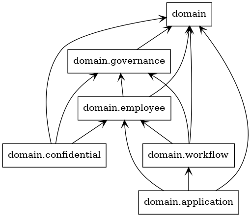

# DDD on Python

Trial and error of DDD on Python.

## Domain model 



```
$ code ./ 
$ pipenv shell
$ pyreverse -o png --ignore=__init___test.py domain/
```

## Set up 

```
$ code ./ 
$ export PIPENV_VENV_IN_PROJECT=1
$ pipenv --python 3.8 
$ pipenv install
```

## Run

```
$ code ./ 
$ pipenv shell
$ python main.py 
```

## Swagger UI

[http://127.0.0.1:8000/docs](http://127.0.0.1:8000/docs)

## Test

```
$ code ./ 
$ pipenv shell
$ pytest command/
```

## Reference

- [Developing inside a Container](https://code.visualstudio.com/docs/remote/containers)
- [docker](https://www.docker.com/)
- [FastAPI](https://fastapi.tiangolo.com/)
- [Swagger](https://swagger.io/)